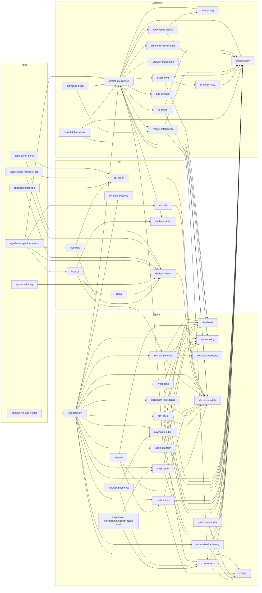

# Module Dependency Graph

**Last Updated:** 2026-05-22
**Scope:** Top ~30 edges across workspace packages, services, apps.

Workspace dependencies use `workspace:*` (pnpm). Direction is
consumer → producer (an arrow `A → B` means A depends on B).

## High-level view

## Top-30 edges (consumer → producer)

| # | Consumer | Producer | Note |
|---|----------|----------|------|
|  1 | api-gateway | authz-policy | JWT + RBAC middleware |
|  2 | api-gateway | domain-services | core CRUD |
|  3 | api-gateway | observability | OTel + audit boot |
|  4 | api-gateway | central-intelligence | brain wiring |
|  5 | api-gateway | payments-ledger | money path |
|  6 | api-gateway | notifications-service | OTP + alerts |
|  7 | api-gateway | document-intelligence | KYC + OCR |
|  8 | api-gateway | file-ingest | conversational ingest |
|  9 | api-gateway | dynamic-sections | adaptive layout signals |
| 10 | api-gateway | enterprise-hardening | middleware |
| 11 | api-gateway | mcp-server | MCP surface |
| 12 | central-intelligence | observability | decision trace |
| 13 | central-intelligence | forecasting-engine | forecasts |
| 14 | central-intelligence | autonomy-governance | caps + handoff |
| 15 | central-intelligence | browser-perception | computer-use |
| 16 | central-intelligence | graph-sync | graph context |
| 17 | central-intelligence | ai-copilot | personas |
| 18 | central-intelligence | aop-compiler | plans |
| 19 | domain-services | database | persistence |
| 20 | domain-services | domain-models | shapes |
| 21 | payments-ledger | database | ledger tables |
| 22 | payments-ledger | connectors | M-Pesa adapter |
| 23 | services/payments | payments-ledger | book of record |
| 24 | identity | notifications-service | OTP delivery |
| 25 | identity | database | identity tables |
| 26 | mcp-server-* | mcp-server | tool registry base |
| 27 | mcp-server-* | connectors | resilience |
| 28 | graph-sync | graph-privacy | DP guard on aggregates |
| 29 | consolidation-worker | central-intelligence | memory layer |
| 30 | apps/* | api-client / api-sdk | typed HTTP |

## Hot paths (read these first)

- Money path: `customer-app → api-client → api-gateway → payments-ledger → connectors(M-Pesa) → database`.
- Brain decision path: `chat-ui → api-gateway → central-intelligence → (autonomy-governance, forecasting-engine, graph-sync) → observability(decision-trace)`.
- Identity path: `mobile/customer-app → api-gateway → identity → database (+ notifications OTP)`.

## Notes

- The dependency direction is enforced by `pnpm-workspace.yaml` and
  `tsconfig` references. CI fails on cycles.
- LITFIN-style architecture-imports lint planned (ADR-0013) to make
  forbidden edges hard errors.
