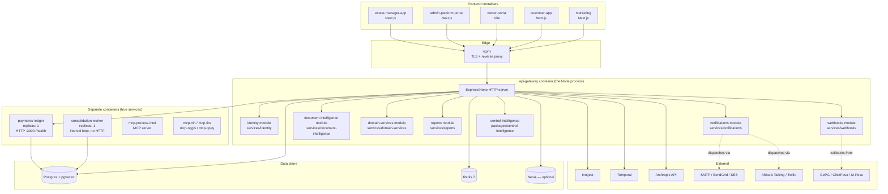

# BORJIE101 — Modular Monolith Topology

**Last Updated:** 2026-05-20
**Audience:** engineers, operators, auditors, new contributors

BORJIE101 is a **modular monolith**. The codebase is organised as if it were microservices — one folder per bounded context under `services/` — but the production deployment runs most of those bounded contexts **in-process inside the `api-gateway` container**. The folder layout reads like a microservices repository; the runtime is a single Node process that imports each bounded context as a library.

This document explains the actual topology, the reasoning behind the choice, and the migration path if any module needs to graduate into a standalone service.

## The actual runtime

The only HTTP servers that actually start are: `api-gateway`, `payments-ledger`, the frontend containers, the 5 MCP servers, and `nginx`. Everything else either loops without HTTP (`consolidation-worker`) or runs as imports inside `api-gateway`.

## Bounded contexts and where they live

### In-process libraries (`replicas: 0` in `docker-compose.production.yml`)

| Bounded context | Folder | Package name | Purpose |
|---|---|---|---|
| Identity / Auth | `services/identity/` | `@borjie/identity-service` | Tenant identity, OTP, invite codes, org-membership, JWT minting |
| Notifications | `services/notifications/` | `@borjie/notifications-service` | SMS, Email, WhatsApp, in-app, queue producer/consumer, templates, preferences |
| Document Intelligence | `services/document-intelligence/` | `@borjie/document-intelligence-service` | OCR, fraud detection, expiry tracking, evidence pack builder |
| Domain Services | `services/domain-services/` | `@borjie/domain-services` | Leases, inspections, negotiations, damage deductions, station-master routing |
| Reports | `services/reports/` | `@borjie/reports-service` | Report generation, scheduling, storage (PDF / Excel / CSV) |
| Webhooks | `services/webhooks/` | `@borjie/webhooks-service` | Outbound webhook delivery, HMAC signing, retry/backoff, inbound verification |

Each of these folders exports its public API from `src/index.ts`. None of them call `app.listen()` at module load. `api-gateway` imports the symbols it needs and mounts the relevant routes/subscribers/workers in its own composition root (`services/api-gateway/src/composition/`).

### Real containers (`replicas: 1+` in `docker-compose.production.yml`)

| Service | Folder | Container | What makes it a real service |
|---|---|---|---|
| API Gateway | `services/api-gateway/` | `borjie-prod-api-gateway` | The HTTP entrypoint. Hosts all in-process modules. |
| Payments Ledger | `services/payments-ledger/` | `borjie-prod-payments` | `src/server.ts` calls `listen()`. Exposes `/health`. Kept separate because the immutable ledger benefits from independent scaling + audit isolation. |
| Consolidation Worker | `services/consolidation-worker/` | `borjie-prod-consolidation` | Long-running interval loop (no HTTP). Triggers the 8-stage nightly sleep consolidation. Separate so a wedged loop does not take down request traffic. |
| MCP servers | `services/mcp-server-{process-intel,nin,firs,nggis,opay}/` | `borjie-prod-mcp-*` | Each is an MCP protocol server (stdio or HTTP) and runs in its own process per the MCP spec. |

### Frontends

`apps/marketing`, `apps/customer-app`, `apps/owner-portal`, `apps/admin-platform-portal`, `apps/estate-manager-app` — five separate frontend containers, all calling the same `api-gateway` over HTTPS via `nginx`.

## Why modular monolith for launch

This is a deliberate choice, not an accident, and the audit (`.audit/deep-audit-2026-05-20.md`) agreed with the reasoning:

1. **Same code organisation, simpler ops.** Bounded-context folders enforce dependency direction (no circular imports between `services/notifications` and `services/identity` because their boundary is a `package.json`). We keep the cognitive benefits of microservices without paying the cost of cross-process RPC, deploy fan-out, distributed tracing, or service-mesh setup.
2. **One deploy unit, one transaction surface.** A lease activation that posts an invoice, fires a notification, and updates the audit log is a single in-process transaction. With six real services we would need either distributed transactions or eventual consistency from day one — a far heavier engineering tax for a 10-tenant launch.
3. **In-process calls are typed.** Module-to-module calls are TypeScript function calls. Refactors propagate at compile time. With HTTP boundaries you trade compile-time safety for a YAML schema in an OpenAPI file that drifts.
4. **One container to scale, debug, profile.** A single Node process is easier to attach a debugger to, easier to flame-graph, and easier to roll back. The audit's BLOCKER list does not include "we can't scale" — it includes "we can't observe drift in the modular monolith because the docs lie about the topology." This document closes that gap.
5. **Defer real extraction until scale demands.** Premature extraction is the most expensive form of microservices regret. We extract a module to a real service the day there is a concrete pressure that the monolith cannot answer.

## When to extract a module to a real service

Extract a module out of `api-gateway` and into its own container the day **any** of the following becomes true:

| Pressure | Example | Why extraction helps |
|---|---|---|
| Independent deploy cadence | The notifications team ships 5x/day, the rest of api-gateway ships weekly. | Decouples blast radius of a notifications change from the rest of the platform. |
| Independent team ownership | A dedicated 4-engineer team owns notifications end-to-end and wants its own CI/CD. | Reduces merge contention on `api-gateway`. |
| Performance isolation | Notifications queue backs up and starves request-handling event loop time. | Separate Node process = separate event loop. |
| Resource isolation | Reports generation occasionally spikes to 4GB memory and OOMs api-gateway. | A reports service with its own memory limit isolates the spike. |
| Failure isolation | A bug in document-intelligence OCR pipeline crashes the process. | A separate container restarts independently; api-gateway stays up. |
| Compliance / data residency | KRA tenant-data export must run in a separate jurisdictional VPC. | A separate service can be deployed to the required region. |

If none of those apply, the module stays in-process. "We might want microservices someday" is **not** a reason to extract.

## Migration playbook (when extraction is warranted)

The folder layout is already designed for this. The 6 modules above each have their own `package.json`, their own tests, and their public surface area is the `index.ts` export. To promote one to a real service:

1. **Add a `src/server.ts`** that boots an Express/Hono app, mounts the module's HTTP routes (today these are mounted by `api-gateway`), exposes `/healthz`, and calls `listen()`.
2. **Wrap the in-process consumers in a typed client.** Existing call sites in `api-gateway` that do `import { sendNotification } from '@borjie/notifications-service'` get replaced with `import { notificationsClient } from '@borjie/notifications-client'` — a generated HTTP client.
3. **Add the `replicas: 1` flag** in `docker-compose.production.yml` (today they have `replicas: 0`). Add a Kubernetes Deployment/Service if running on K8s.
4. **Move secrets and env vars** from `api-gateway`'s `.env.production` to the new service's `.env.production`. The audit shipped `NOTIFICATIONS_SERVICE_URL` and `INTERNAL_API_KEY` ahead of this migration — those are designed for service-to-service calls **once** the extraction happens.
5. **Add observability** — OTel traces with `service.name` set to the extracted module so the trace UI can distinguish call originator from receiver.
6. **Rename the package.** `@borjie/notifications-service` is misleading today. After extraction it becomes truthful. (The rename — and the inverse rename of unextracted modules from `*-service` to `*-lib` — is tracked as a follow-up.)
7. **Add a back-pressure / circuit-breaker layer** in the now-HTTP boundary. In-process calls don't need it; HTTP calls absolutely do.

## Naming caveat (read this once and move on)

Six packages are still named `@borjie/<name>-service` even though they are in-process libraries today. The rename to `@borjie/<name>-lib` (or equivalent) is a bigger refactor than this documentation pass and is **out of scope** for the current audit fix. The folder name `services/<name>/`, the package name, and the compose-file service block all exist as if they were microservices because they were designed to become microservices the day extraction is warranted. Until then, the in-process header in each `services/<name>/README.md` is the contract.

## Related documents

- `Docs/ARCHITECTURE.md` — system-wide architecture (this topology, expanded)
- `Docs/ARCHITECTURE_CENTRAL_COMMAND.md` — operator-facing brain architecture
- `Docs/ARCHITECTURE_BRAIN.md` — the singular-intelligence + persona taxonomy
- `Docs/DEPLOYMENT.md` — operational runbook
- `Docs/ADR/` — every architectural decision record
- `docker-compose.production.yml` — the source of truth for what actually runs in prod
